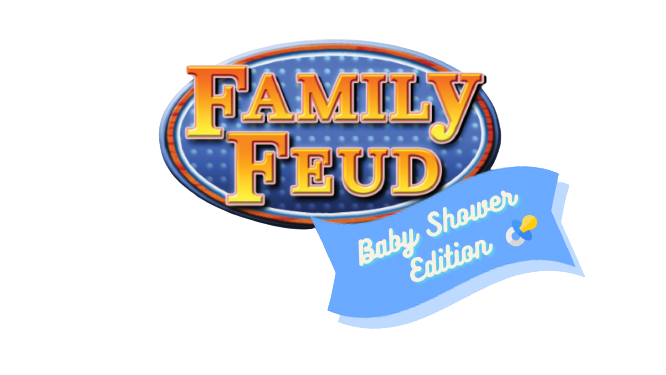

# Family Feud: Baby Shower Edition!

## Demos

## Features
- Scoreboard
  - Click next to redirect to the 5 rounds
  - Team scores update after each round
- Round(s)
  - Round score updates when answer is flipped
  - Answer flips with audio
  - To give strike during the faceoff, press <kbd>Shift</kbd> + <kbd>x</kbd>
  - To give a strike once faceoff is over, press <kbd>x</kbd>.
  - To add points to team 1, press <kbd>1</kbd>
  - To add points to team 2, press <kbd>2</kbd>
  - Press <kbd>→</kbd> & hit next to head to scoreboard after round finishes

## Usage

### Running the App Locally
1. Create a new directory & navigate to it. 
2. Create a new React app in it by running the command `npx create-react-app`.
3. Download a ZIP file or clone the repository, & replace the src folder with the ZIP file/cloned repo's src folder.
4. In file directory, run `npm start`.
5. Run `npm i use-sound` in order to hear game music & sound effects.
6. Open [http://localhost:3000](http://localhost:3000) to view the game in your browser.

The page will reload when you make changes.
You may also see any lint errors in the console.

<!-- This project was bootstrapped with [Create React App](https://github.com/facebook/create-react-app). -->

Actual hosting coming soon.

## Technologies
- React.js
- Javascript
- HTML/CSS

## License
[MIT]()